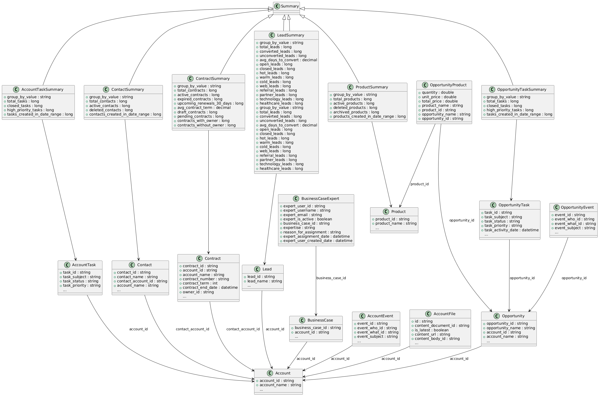

# Salesforce RAW API

## Table of Contents

1. [Introduction](#introduction)
2. [Basic Structure of SQL Files](#basic-structure-of-sql-files)
3. [Types of Queries](#types-of-queries)
   - [Basic Query Example](#basic-query-example)
   - [Summary Query Example](#summary-query-example)
4. [Filters](#filters)
   - [Basic Equality Filters](#basic-equality-filters)
   - [Substring Search](#substring-search)
   - [Equality Search with Any Value from a Comma-Separated List](#equality-search-with-any-value-from-a-comma-separated-list)
   - [Date Comparison](#date-comparison)
5. [Pagination](#pagination)

## Introduction

This repository provides a streamlined API layer built on top of Salesforce, designed using the [RAW platform](https://raw-labs.com/). The API simplifies access to Salesforce data by offering well-defined endpoints for major Salesforce objects, such as accounts, contacts, leads, opportunities, and custom entities. By leveraging the RAW platform, this solution efficiently handles data retrieval and filtering without the need for complex setups or additional infrastructure.

The goal of this API is to make Salesforce data easily accessible for various applications and services, focusing on simplicity, flexibility, and scalability. Each endpoint is designed to return relevant data with support for filtering through query parameters, allowing users to query Salesforce data in a straightforward, RESTful manner.

### Entities




### Endpoints

Please refer to the [API documentation](openapi.md) and [OpenAPI spec yaml](openapi.yaml) for a detailed list of endpoints and their descriptions.


## Basic Structure of SQL Files

Each SQL file contains a query that retrieves data from Salesforce. The queries are written in standard SQL and are designed for flexibility, supporting dynamic filtering and pagination.


## Types of Queries

1. **Basic & Hierarchical Queries**: These queries retrieve data from a single table or a set of joined tables with potential parent-child relationships. Dynamic filtering and pagination are supported.
2. **Summary Queries**: These queries aggregate data using functions like `SUM`, `COUNT`, `AVG`, etc.


#### Basic Query Example
Here is an example of a basic query from <m>accounts.sql</m>:

```sql
-- @param account_name the name of the Salesforce Account
-- @type account_name varchar
-- @default account_name null
-- @param account_industry comma-separated list of account industries - permissible values can be found in endpoint '/salesforce_gpt/enumeration/industries'. If null, all industries are included.
-- @type account_industry varchar
-- @default account_industry null
-- @param account_type comma-separated list of account types - permissible values can be found in endpoint '/salesforce_gpt/enumeration/account_types'. If null, all account types are included.
-- @type account_type varchar
-- @default account_type null
-- @param account_created_date_range_start account creation date is greater than or equal to account_created_date_range_start. Format YYYY-MM-DD.
-- @type account_created_date_range_start date
-- @default account_created_date_range_start null
-- @param account_created_date_range_end account creation date is lower than or equal to account_created_date_range_end. Format YYYY-MM-DD.
-- @type account_created_date_range_end date
-- @default account_created_date_range_end null
-- @param account_last_activity_date_range_start account's last activity date is greater than or equal to account_last_activity_date_range_start. Format YYYY-MM-DD.
-- @type account_last_activity_date_range_start date
-- @default account_last_activity_date_range_start null
-- @param account_last_activity_date_range_end account's last activity date is lower than or equal to account_last_activity_date_range_end. Format YYYY-MM-DD.
-- @type account_last_activity_date_range_end date
-- @default account_last_activity_date_range_end null
-- @param account_billing_country the billing address country of the account
-- @type account_billing_country varchar
-- @default account_billing_country null
-- @param account_billing_state the billing address state of the account
-- @type account_billing_state varchar
-- @default account_billing_state null
-- @param account_billing_postal_code the billing address postal code of the account
-- @type account_billing_postal_code integer
-- @default account_billing_postal_code null
-- @param account_billing_street the billing address street of the account
-- @type account_billing_street varchar
-- @default account_billing_street null
-- @param account_billing_city the billing address city of the account
-- @type account_billing_city varchar
-- @default account_billing_city null
-- @param account_is_deleted account deleted
-- @type account_is_deleted boolean
-- @default account_is_deleted null
-- @param annual_revenue_range_start Filter accounts with annual revenue greater than or equal to this value.
-- @type annual_revenue_range_start bigint
-- @default annual_revenue_range_start null
-- @param annual_revenue_range_end Filter accounts with annual revenue less than or equal to this value.
-- @type annual_revenue_range_end bigint
-- @default annual_revenue_range_end null
-- @param number_of_employees_range_start Filter accounts with number of employees greater than or equal to this value.
-- @type number_of_employees_range_start integer
-- @default number_of_employees_range_start null
-- @param number_of_employees_range_end Filter accounts with number of employees less than or equal to this value.
-- @type number_of_employees_range_end integer
-- @default number_of_employees_range_end null
-- @param account_rating Filter by account rating - permissible values can be found in endpoint '/salesforce_gpt/enumeration/ratings'. If null, all account ratings are included.
-- @type account_rating varchar
-- @default account_rating null
-- @param owner_id Filter by Salesforce User ID of the account owner.
-- @type owner_id varchar
-- @default owner_id null
-- @param clean_status Filter by clean status of the account. Permissible values are 'Clean', 'Pending'.
-- @type clean_status varchar
-- @default clean_status null
-- @param account_source Filter by the source of the account.
-- @type account_source varchar
-- @default account_source null
-- @param operating_hours_id Filter by operating hours ID of the account.
-- @type operating_hours_id varchar
-- @default operating_hours_id null
-- @param page the current page number to retrieve
-- @type page integer
-- @default page null
-- @param page_size the number of records per page. Default value is 25.
-- @type page_size integer
-- @default page_size null
-- @return Salesforce accounts with pagination and supports various filters like account industry, account type, and account billing country.

WITH filtered_accounts AS (
    SELECT "id" as "account_id",
           "is_deleted" as "account_is_deleted",
           "master_record_id" as "account_master_record_id",
           "name" as "account_name",
           "type" as "account_type",
           "parent_id" as "account_parent_id",
           "billing_street" as "account_billing_street",
           "billing_city" as "account_billing_city",
           "billing_state" as "account_billing_state",
           "billing_postal_code" as "account_billing_postal_code",
           "billing_country" as "account_billing_country",
           "billing_latitude" as "account_billing_latitude",
           "billing_longitude" as "account_billing_longitude",
           "billing_geocode_accuracy" as "account_billing_geocode_accuracy",
           "billing_address" as "account_billing_address",
           "shipping_street" as "account_shipping_street",
           "shipping_city" as "account_shipping_city",
           "shipping_state" as "account_shipping_state",
           "shipping_postal_code" as "account_shipping_postal_code",
           "shipping_country" as "account_shipping_country",
           "shipping_latitude" as "account_shipping_latitude",
           "shipping_longitude" as "account_shipping_longitude",
           "shipping_geocode_accuracy" as "account_shipping_geocode_accuracy",
           "shipping_address" as "account_shipping_address",
           "phone" as "account_phone",
           "fax" as "account_fax",
           "account_number" as "account_account_number",
           "website" as "account_website",
           "photo_url" as "account_photo_url",
           "sic" as "account_sic",
           "industry" as "account_industry",
           "annual_revenue" as "account_annual_revenue",
           "number_of_employees" as "account_number_of_employees",
           "ownership" as "account_ownership",
           "ticker_symbol" as "account_ticker_symbol",
           "description" as "account_description",
           "rating" as "account_rating",
           "site" as "account_site",
           "owner_id" as "account_owner_id",
           "created_date" as "account_created_date",
           "created_by_id" as "account_created_by_id",
           "last_modified_date" as "account_last_modified_date",
           "last_modified_by_id" as "account_last_modified_by_id",
           "system_modstamp" as "account_system_modstamp",
           "last_activity_date" as "account_last_activity_date",
           "last_viewed_date" as "account_last_viewed_date",
           "last_referenced_date" as "account_last_referenced_date",
           "jigsaw" as "account_jigsaw",
           "jigsaw_company_id" as "account_jigsaw_company_id",
           "clean_status" as "account_clean_status",
           "account_source" as "account_account_source",
           "duns_number" as "account_duns_number",
           "tradestyle" as "account_tradestyle",
           "naics_code" as "account_naics_code",
           "naics_desc" as "account_naics_desc",
           "year_started" as "account_year_started",
           "sic_desc" as "account_sic_desc",
           "dandb_company_id" as "account_dandb_company_id",
           "operating_hours_id" as "account_operating_hours_id"
    FROM salesforce.salesforce_account
    WHERE (industry ILIKE ANY (string_to_array(:account_industry, ','))
           OR :account_industry IS NULL)
      AND (type ILIKE ANY (string_to_array(:account_type, ','))
           OR :account_type IS NULL)
      AND (name ILIKE CONCAT('%',:account_name,'%') OR :account_name IS NULL)
      AND ((created_date >= :account_created_date_range_start::timestamp) OR (:account_created_date_range_start IS NULL))
      AND ((created_date <= :account_created_date_range_end::timestamp) OR (:account_created_date_range_end IS NULL))
      AND ((last_activity_date >= :account_last_activity_date_range_start::date) OR (:account_last_activity_date_range_start IS NULL))
      AND ((last_activity_date <= :account_last_activity_date_range_end::date) OR (:account_last_activity_date_range_end IS NULL))
      AND (billing_country ILIKE CONCAT('%',:account_billing_country,'%') OR :account_billing_country IS NULL)
      AND (billing_state ILIKE CONCAT('%',:account_billing_state,'%') OR :account_billing_state IS NULL)
      AND (billing_postal_code ILIKE CONCAT('%',:account_billing_postal_code,'%') OR :account_billing_postal_code IS NULL)
      AND (billing_street ILIKE CONCAT('%',:account_billing_street,'%') OR :account_billing_street IS NULL)
      AND (billing_city ILIKE CONCAT('%',:account_billing_city,'%') OR :account_billing_city IS NULL)
      AND (is_deleted=:account_is_deleted OR :account_is_deleted IS NULL)
      AND (annual_revenue >= :annual_revenue_range_start OR :annual_revenue_range_start IS NULL)
      AND (annual_revenue <= :annual_revenue_range_end OR :annual_revenue_range_end IS NULL)
      AND (number_of_employees >= :number_of_employees_range_start OR :number_of_employees_range_start IS NULL)
      AND (number_of_employees <= :number_of_employees_range_end OR :number_of_employees_range_end IS NULL)
      AND (rating ILIKE :account_rating OR :account_rating IS NULL)
      AND (owner_id = :owner_id OR :owner_id IS NULL)
      AND (clean_status ILIKE :clean_status OR :clean_status IS NULL)
      AND (account_source ILIKE :account_source OR :account_source IS NULL)
      AND (operating_hours_id = :operating_hours_id OR :operating_hours_id IS NULL)
)
SELECT *
FROM filtered_accounts
ORDER BY account_id
    LIMIT COALESCE(:page_size, 25) OFFSET (COALESCE(:page, 1) - 1) * COALESCE(:page_size, 25);
```


#### Summary Query Example

```sql 
-- @param opportunity_name the name of the opportunity. Substring search is supported.
-- @type opportunity_name varchar
-- @default opportunity_name null
-- @param opportunity_id Salesforce Opportunity ID
-- @type opportunity_id varchar
-- @default opportunity_id null
-- @param task_subject the subject of the task related with a given opportunity. Substring search is supported.
-- @type task_subject varchar
-- @default task_subject null
-- @param task_subtype the subtype of the task related with a given opportunity. Permissible values can be found in endpoint '/salesforce_gpt/enumeration/task_subtypes'
-- @type task_subtype varchar
-- @default task_subtype null
-- @param task_status the status of the task related with a given opportunity. E.g., 'Not Started', 'Completed', 'In Progress'.
-- @type task_status varchar
-- @default task_status null
-- @param task_priority the priority of the task (High, Medium, Low)
-- @type task_priority varchar
-- @default task_priority null
-- @param task_created_date_range_start start date to filter tasks by creation date
-- @type task_created_date_range_start date
-- @default task_created_date_range_start null
-- @param task_created_date_range_end end date to filter tasks by creation date
-- @type task_created_date_range_end date
-- @default task_created_date_range_end null
-- @param group_by_field field to group the summary by (e.g., 'task_status', 'task_priority', 'task_subtype')
-- @type group_by_field varchar
-- @default group_by_field null
-- @return summary of the total number of tasks, grouped by the specified field.

WITH base_summary AS (
    SELECT
        t.id AS task_id,
        t.subject AS task_subject,
        t.status AS task_status,
        t.priority AS task_priority,
        t.task_subtype AS task_subtype,
        t.activity_date AS task_activity_date,
        t.is_closed AS task_is_closed,
        t.is_high_priority AS task_is_high_priority,
        t.created_date AS task_created_date,
        o.name AS opportunity_name,
        a.name AS account_name
    FROM salesforce.salesforce_task t
             INNER JOIN salesforce.salesforce_opportunity o ON o.id = t.what_id
             INNER JOIN salesforce.salesforce_account a ON a.id = o.account_id
    WHERE (o.name ILIKE CONCAT('%', :opportunity_name, '%') OR :opportunity_name IS NULL)
      AND (o.id = :opportunity_id OR :opportunity_id IS NULL)
      AND (t.subject ILIKE CONCAT('%', :task_subject, '%') OR :task_subject IS NULL)
      AND (t.task_subtype ILIKE ANY (string_to_array(:task_subtype, ',')) OR :task_subtype IS NULL)
      AND (t.status ILIKE ANY (string_to_array(:task_status, ',')) OR :task_status IS NULL)
      AND (t.priority ILIKE ANY (string_to_array(:task_priority, ',')) OR :task_priority IS NULL)
      AND (t.created_date >= :task_created_date_range_start::timestamp OR :task_created_date_range_start IS NULL)
      AND (t.created_date <= :task_created_date_range_end::timestamp OR :task_created_date_range_end IS NULL)
)
SELECT
    CASE
        WHEN :group_by_field = 'task_status' THEN task_status
        WHEN :group_by_field = 'task_priority' THEN task_priority
        WHEN :group_by_field = 'task_subtype' THEN task_subtype
        ELSE 'All'
        END AS group_by_value,

    COUNT(task_id) AS total_tasks,
    COUNT(CASE WHEN task_is_closed = true THEN 1 END) AS closed_tasks,
    COUNT(CASE WHEN task_is_high_priority = true THEN 1 END) AS high_priority_tasks,
    COUNT(CASE WHEN task_created_date >= :task_created_date_range_start::timestamp
          AND task_created_date <= :task_created_date_range_end::timestamp
          THEN 1 END) AS tasks_created_in_date_range
FROM base_summary
GROUP BY group_by_value
ORDER BY group_by_value;

```

## Filters

This section explains the different types of filters used in the SQL queries:

### Basic Equality Filters

These filters check if a column's value is equal to a specified parameter or `NULL` if no filter is applied.

**Example:**

```sql
AND (is_deleted = :account_is_deleted OR :account_is_deleted IS NULL)
```

### Substring Search

These filters search for substrings in columns. If no filter is applied, the parameter is `NULL`.

**Example:**

```sql
AND (name ILIKE CONCAT('%', :account_name, '%') OR :account_name IS NULL)
```

### Equality Search with Any Value from a Comma-Separated List

These filters allow matching any value from a comma-separated list, or no filter if the parameter is `NULL`.

**Example:**

```sql
AND (industry ILIKE ANY (string_to_array(:account_industry, ',')) OR :account_industry IS NULL)
```

### Date Comparison

These filters compare a column’s date value with a specified date range, or allow null values if no filter is applied.

**Example:**

```sql
AND (created_date >= :account_created_date_range_start OR :account_created_date_range_start IS NULL)
```

## Pagination

The queries support pagination through the use of `LIMIT` and `OFFSET`. The `page` parameter specifies the current page number, while the `page_size` parameter controls the number of records per page. The default value for `page_size` is 25.

**Example:**

```sql
LIMIT COALESCE(:page_size, 25)
OFFSET (COALESCE(:page, 1) - 1) * COALESCE(:page_size, 25);
```
